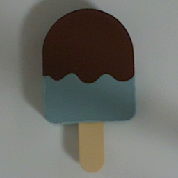

# Anomaly detection examples

# About

# Install

Required
- [Anomalib - Getting Started](https://openvinotoolkit.github.io/anomalib/getting_started/index.html)
- [OpenCV](https://github.com/opencv/opencv)

Optional
- [Intel RealSense SDK 2.0](https://dev.intelrealsense.com/docs/installation)


# Dataset

datasets/datasets.zip

|               | Normal        | Abnormal        |
| ------------- | ------------- | ------------- |
| Ice pop        |  |  |
| Donuts      |  |  |


# Annotation

```
python tools/annotation_tool.py
```

# Train

```
python anomalib/tools/train.py --config .\configs\ice_pop_patchcore_config.yaml
```

# Inference by RealSense camera

```
python inferencers/anomaly_detection_torch_camera.py \
  --weight=results/patchcore/ice_pop/run/weights/torch/model.pt"
```

# Convert TensorFlow Lite model and run inference.
- [Anomaly detection with TensorFlow Lite.](./docs/anomaly_detection_with_tflite.md)

# Reference

- [Anomalib](https://openvinotoolkit.github.io/anomalib/index.html)
- [onn2tf](https://github.com/PINTO0309/onnx2tf)