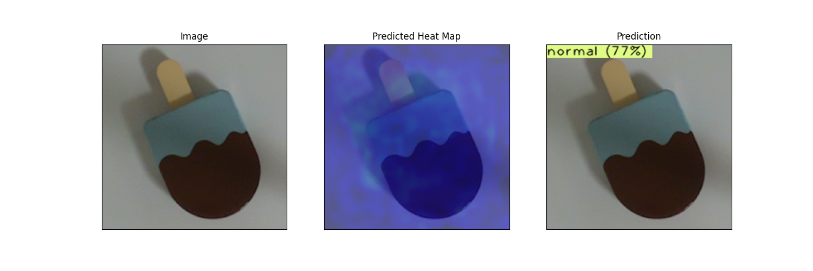
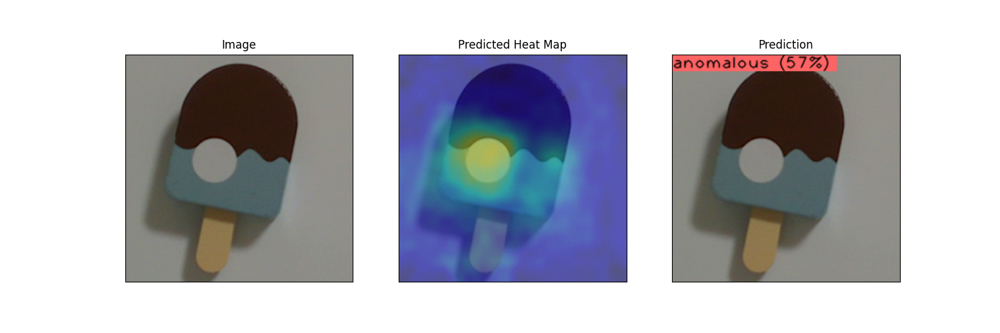
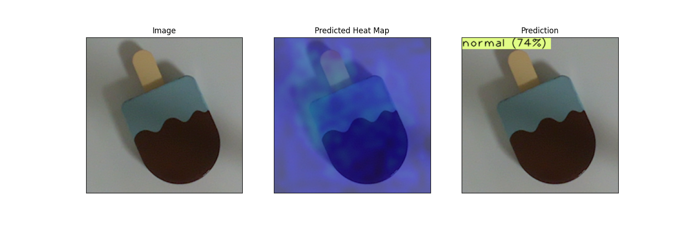
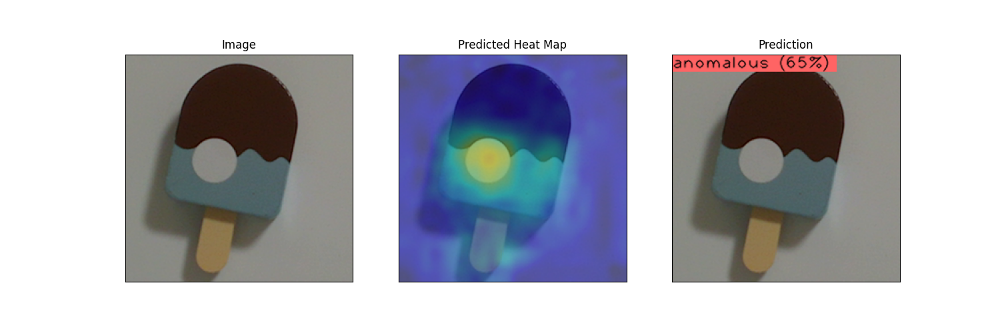

# Anomaly detection with TensorFlow Lite.

## Description

This is the content that converts the model trained with [ANOMALiB](https://github.com/openvinotoolkit/anomalib) to [TensorFlow Lite](https://www.tensorflow.org/lite) Model and performs inference.
Convert the model by [onn2tf](https://github.com/PINTO0309/onnx2tf).

1. Train anomaly detection model by ANOMALiB.
2. Convert ONNX model to TensorFLow Lite model by onn2tf.
3. Inference with TensorFlow Lite.

## Installation

Clone this repository.
```Shell
git clone https://github.com/NobuoTsukamoto/anomaly_detection_examples.git
```

Get a submodule.
```Shell
cd anomaly_detection_examples
git submodule update --init --recursive
```

Install my fork of [ANOMALiB](https://github.com/NobuoTsukamoto/anomalib).
This is because it contains the code for onnx, tensorflow lite inferencers, and a patch for the model in patchcore.
- [[Bug]: Patchcore exported ONNX file is not usable #967](https://github.com/openvinotoolkit/anomalib/issues/967)

```Shell
pip install -e .
```

go to the `anomaly_detection_examples` directory.
```Shell
cd ..
```

Install onnx2tf
```Shell
pip install -U onnx==1.13.1 \
&& pip install -U nvidia-pyindex \
&& pip install -U onnx-graphsurgeon \
&& pip install -U onnxruntime==1.15.0 \
&& pip install -U onnxsim==0.4.17 \
&& pip install -U simple_onnx_processing_tools \
&& pip install -U onnx2tf \
&& pip install -U h5py==3.7.0 \
&& pip install -U psutil==5.9.5
&& pip install -U onnx2tf
```
Install TensorFlow Lite
```Shell
pip install -U tflite-runtime
```

## Prepare dataset

Unzip datasets.zip in the datasets directory.
```Shell
cd datasets
unzip datasets.zip
cd ..
```

The directory structure will be as follows.
```
datasets
  + donuts
    + abnormal
      + *.png
    + normal
      + *.png
  + ice_pop
    + abnormal
      + *.png
    + normal
      + *.png
```

## Training

Train [PatchCore](https://github.com/openvinotoolkit/anomalib/tree/main/src/anomalib/models/patchcore) model using ice pop images.

```Shell
python .\anomalib\tools\train.py \
    --config .\configs\ice_pop_patchcore_resnet18_config.yaml
```

At this time, the following models have been confirmed to be convertible to 
TensorFlow Lite models.
- [PaDiM](https://github.com/openvinotoolkit/anomalib/tree/main/src/anomalib/models/padim)
- PatchCore (ResNet18 backborn)

Note:
Specify `onnx` for `export_mode` in the config file.
```YAML
optimization:
  export_mode: onnx # options: onnx, openvino
```

Here are the results on the testset:
```Shell
┏━━━━━━━━━━━━━━━━━━━━━━━━━━━┳━━━━━━━━━━━━━━━━━━━━━━━━━━━┓
┃        Test metric        ┃       DataLoader 0        ┃
┡━━━━━━━━━━━━━━━━━━━━━━━━━━━╇━━━━━━━━━━━━━━━━━━━━━━━━━━━┩
│        image_AUROC        │            1.0            │
│       image_F1Score       │            1.0            │
└───────────────────────────┴───────────────────────────┘
```

The results of normal and abnormal images are as follows.
| Normal                    | Abnormal |
|---------------------------|----------|
| 20230603_174441986459.png | 20230603_180645418385.png |
|  |  |


ONNX model is deployed.
```
results
  + patchcore
    + ice_pop
      + run
        + images
        + weights
          + lightning
          + onnx
            + metadata.json
            + model.onnx
        + config.yaml
        + config_original.yaml
```

## Convert ONNX Model to TensorFlow Lite Model

Convert to TensorFlow Lite model with onn2tf.
Go to the directory where the ONNX model is deployed.
```Shell
cd results/patchcore/run/weights/onnx
```
Then convert.
```Shell
onnx2tf -i model.onnx
```

A TensorFlow Lite model is deployed in the saved_model directory.
```
saved_model
  + model_float32.tflite
```

## Inference with TensorFlow Lite

The python code for inference with TensorFlow Lite is below.
```
inferencers
  + anomaly_detection_tflite_image.py
```

The arguments required for inference are:
- `--weights`  
  The path of the TensorFlow Lite model.  
- `--input`  
  Path of the input image file.
- `--metadata`  
  Path of `metadata.json` that stores parameters for post-processing of inference results.
- `--output`  
  File path of output image.
- `--input_shape`
  Input shape (to be removed). Specify 224,224 for PatchCore

go to the `anomaly_detection_examples/inferencers` directory and exec `anomaly_detection_tflite_image.py`.
```Shell
 python anomaly_detection_tflite_image.py \
   --weights ../results/patchcore/ice_pop/run/weights.onnx/saved_model/model_float32.tflite \
   --metadata ../results/patchcore/ice_pop/run/weights/onnx/metadata.json \
   --input ../datasets/ice_pop/normal/20230603_174441986459.png /
   --output ./tflite_20230603_174441986459.png \
   --input_shape=224,224
```

Similarly, check the results of inference in TensorFlow Lite.
| Normal                    | Abnormal |
|---------------------------|----------|
| 20230603_174441986459.png | 20230603_180645418385.png |
|  |  |


## Reference
- https://twitter.com/Nextremer_nb_o/status/1669692500603473922